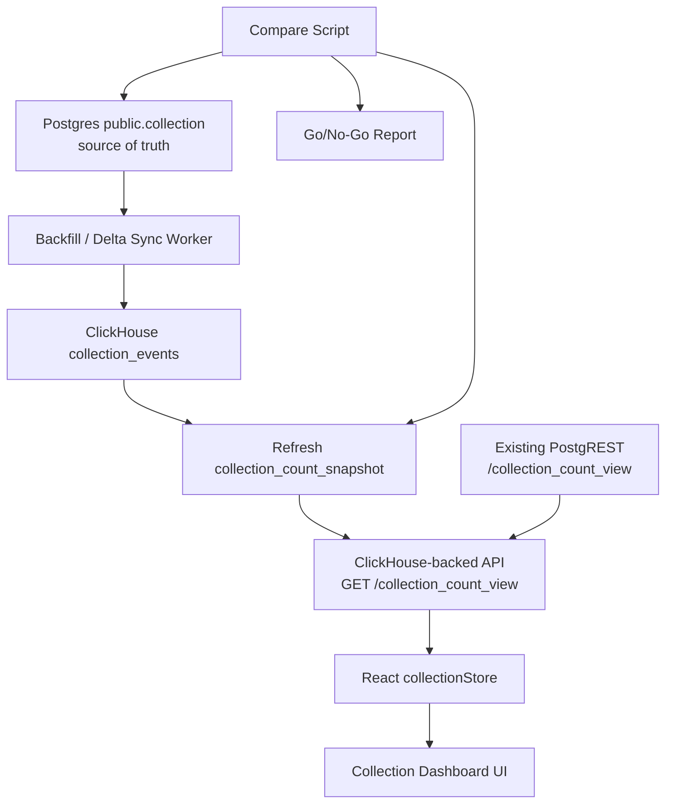

# 設計書

## Overview

本設計は、AtpDashboard の重い分析系readの第一弾として、`collection_count_view` 相当の取得経路を ClickHouse read model へ段階移行するためのものである。Postgres は引き続き source of truth とし、ClickHouse は `collection_count_view` 互換レスポンスを高速に返すための派生データストアとして扱う。

MVPでは以下に限定する。

- 対象endpointは `collection_count_view` のみ
- PostgresからClickHouseへのバックフィル
- ClickHouse集計snapshot
- PostgREST互換JSONを返す小さなAPI
- `packages/frontend/src/zustand/collectionStore.ts` の取得先を環境変数で切替
- Postgres版との比較・Go/No-Go判定
- 既存PostgRESTへのフォールバック

リアルタイム完全同期、他endpoint移行、UIデザイン変更、Postgres全面移行はMVP範囲外とする。

この移行の戦略的価値は、AT Protocol collection analytics の基盤をPostgres OLTPから切り離し、将来の成長ランキング、急増検知、異常検知、公開分析APIへ拡張できるread modelを作ることにある。MVPでは野心を広げすぎず、まず `collection_count_view` の互換・速度・運用安全性だけを成立させる。

## Steering Document Alignment

### Technical Standards (tech.md)

`.spec-workflow/steering/tech.md` は存在しない。既存リポジトリの実態に合わせ、以下を設計標準とする。

- フロントエンドは既存の React + Vite + Zustand 構成を維持する
- 既存PostgREST endpointのレスポンス形状を壊さない
- DB関連DDLは `sql/` 配下にDB種別ごとに分離して配置する
- shell実行はプロジェクト指示に従い `rtk` 経由とする
- Next.jsではなくViteプロジェクトであるため、ビルド確認は `pnpm build` を使う。ただしビルド実行時はプロジェクト指示に従い権限付きで行う

### Project Structure (structure.md)

`.spec-workflow/steering/structure.md` は存在しない。既存構成に合わせ、追加ファイルは以下の配置方針にする。

```text
sql/
  clickhouse/
    001_collection_events.sql
    002_collection_count_snapshot.sql
    003_collection_count_refresh.sql
  postgres/
    clickhouse/
      sync_state.sql

scripts/
  clickhouse/
    backfill-collection-events.ts
    refresh-collection-count-snapshot.ts
    compare-collection-count-view.ts

packages/
  api/
    src/
      collection-count/
        server.ts
        clickhouse.ts
        fallback.ts
        status.ts
  clickhouse-tools/
    src/
      event-key.ts
      backfill-collection-events.ts
      refresh-collection-count-snapshot.ts
      compare-collection-count-view.ts
  frontend/
    src/
      config/
        endpoints.ts
      zustand/
        collectionStore.ts

docs/
  clickhouse-partial-migration-runbook.md
```

API層は、MVPでは既存PostgRESTを運営している自サーバー側に小さなNode APIとして追加する。ViteフロントはVercel上で静的配信されているため、ブラウザからClickHouseへ直接接続しない。ClickHouse自体にはHTTP interfaceがあるが、認証情報と固定SQLをサーバー側に隠蔽する必要があるため、フロントとClickHouseの間にAPI層を置く。

MVPの仮ランタイムは **自サーバー上のHono Node API** とする。既存PostgRESTと同じ運用境界に置けるため、Vercel FunctionsやCloudflare Workersよりも、Postgres fallback・内部ネットワーク・秘密情報管理を揃えやすい。Design上は「自サーバーに常駐するHono API」を前提にtimeout、rate limit、CORS、secret管理を定義する。

リポジトリ上の配置は `packages/api/src/collection-count/` とし、Viteアプリとは別package・別プロセスのbackend serviceとして実装する。本番配置では、既存PostgRESTを公開している自サーバー上で `systemd` などにより常駐させ、Cloudflare Zero Trust / Cloudflare Tunnel の公開routeでPostgRESTとは明確に分離する。Vercel上には配置しない。

公開pathの第一候補は `https://collectiondata.usounds.work/api/analytics/collection_count_view` とする。既存PostgRESTの `https://collectiondata.usounds.work/collection_count_view` はfallback先として残し、ClickHouse-backed Hono APIは `/api/analytics/*` にだけ公開する。これによりPostgRESTの自動生成route、`/rpc/*`、既存view routeと衝突しない。

同じHono backend serviceにMCP server endpointを追加することは可能だが、MVPの公開APIとは分離する。MCP endpointは `https://collectiondata.usounds.work/api/mcp` または別hostnameに置き、Cloudflare Accessで管理者/開発者だけに制限する。MCPは運用操作ではなく、AIクライアントへ分析結果を渡すread-only interfaceとして扱う。

MCP toolの初期候補:

- `get_new_nsids_this_week`: 今週新しく観測されたNSID/collectionを返す
- `get_top_event_nsids`: 指定期間でイベント数が多かったNSID/collectionを返す
- `get_weekly_user_trend`: 今週の日次ユーザー数推移を返す
- `get_weekly_collection_trend`: 今週の日次collection/event数推移を返す
- `get_collection_trend`: 指定collection/NSIDの期間内推移を返す
- `get_collection_snapshot_status`: snapshot freshness、refresh_id、fallback状態を返す

MCP toolはClickHouseへ移行済みのread modelから返せる範囲だけを対象にする。MVPでは `collection_count_view` 互換snapshotと、その実装で自然に得られるcollection/NSID集計に限定し、未移行のviewや未実装の日次bucketを前提にしたtoolは実装しない。週次推移などは将来、日次bucketの集計tableまたはmaterialized view相当が追加された時点で有効化する。任意SQL実行、production backfill実行、mutation、fallback切替などの操作系toolはMVPでは提供しない。

Cloudflare Zero Trust のrouting例:

```text
collectiondata.usounds.work/collection_count_view
  -> PostgREST

collectiondata.usounds.work/rpc/*
  -> PostgREST

collectiondata.usounds.work/api/analytics/*
  -> Hono ClickHouse API

collectiondata.usounds.work/api/mcp
  -> Hono MCP endpoint, Cloudflare Access required
```

ClickHouse本体はOSS版を第一候補とし、ClickHouse Cloud前提にはしない。ただし既存PostgresサーバーのCPU/メモリ/ディスクI/Oが強くない前提を置き、原則としてPostgres本体と同居させない。MVP Demoでは別VMまたは明示的にresource limitされた環境で試し、同居は負荷測定で安全が確認できた場合のみ許可する。

## Code Reuse Analysis

### Existing Components to Leverage

- **`packages/frontend/src/zustand/collectionStore.ts`**: コレクション一覧取得の唯一の主要入口。取得URLを環境変数経由にすることでUI変更なしに切替可能にする。
- **`packages/frontend/src/types/collection.ts`**: 既存 `Collection` 型をClickHouse版レスポンス互換の基準として使う。
- **`sql/postgres/view/collection_count_view.sql`**: Postgres版の正確な互換契約の基準。`did:web:lexicon.store` 除外、`max` 降順、返却列をClickHouse版の契約に反映する。
- **`docs/clickhouse-partial-migration-plan.md`**: MVP範囲、ClickHouseスキーマ、同期方針、ロールバック方針の下敷き。
- **`scripts/daily_maintenance.sh`**: 既存メンテナンススクリプトの運用配置の参考。ただしClickHouse同期処理は分離する。

### Integration Points

- **Postgres `public.collection`**: source of truth。バックフィルと差分同期の読み取り元。
- **ClickHouse `atp_dashboard.collection_events`**: Postgres `collection` から派生したraw相当データ。
- **ClickHouse `atp_dashboard.collection_count_snapshot`**: `collection_count_view` 互換APIの読み取り元。
- **API層 `GET /collection_count_view`**: フロントエンドから見えるClickHouse-backed endpoint。
- **既存PostgREST `https://collectiondata.usounds.work/collection_count_view`**: フォールバック先および比較対象。

## Architecture



### Modular Design Principles

- **Single File Responsibility**: DDL、同期、API、比較、フロント設定を分離する
- **Component Isolation**: UIコンポーネントは変更せず、データ取得URLの切替だけに留める
- **Service Layer Separation**: ClickHouse接続はAPI層・同期スクリプトに閉じ込める
- **Utility Modularity**: watermark、ClickHouse insert、Postgres batch read、比較ロジックは個別関数として分離する

## Components and Interfaces

### ClickHouse DDL

- **Purpose:** `collection_count_view` 相当を高速に返すためのClickHouseテーブルを定義する
- **Interfaces:** SQLファイル
- **Dependencies:** ClickHouse
- **Reuses:** `docs/clickhouse-partial-migration-plan.md` のDDL案

DDL:

```sql
CREATE DATABASE IF NOT EXISTS atp_dashboard;

CREATE TABLE IF NOT EXISTS atp_dashboard.collection_events
(
    event_key String,
    did String,
    collection String,
    rkey String,
    created_at Nullable(DateTime64(6, 'UTC')),
    created_at_key String,
    ingested_at DateTime64(3, 'UTC') DEFAULT now64(3)
)
ENGINE = MergeTree
PARTITION BY toYYYYMM(coalesce(created_at, toDateTime64('1970-01-01 00:00:00', 6, 'UTC')))
ORDER BY (event_key, collection, created_at_key);

CREATE TABLE IF NOT EXISTS atp_dashboard.collection_count_snapshot
(
    refresh_id UUID,
    collection String,
    total_count UInt64,
    recent_count UInt64,
    min_created_at Nullable(DateTime64(6, 'UTC')),
    max_created_at Nullable(DateTime64(6, 'UTC')),
    refreshed_at DateTime64(3, 'UTC')
)
ENGINE = ReplacingMergeTree(refreshed_at)
ORDER BY (refresh_id, collection);

CREATE TABLE IF NOT EXISTS atp_dashboard.collection_count_refresh_manifest
(
    refresh_id UUID,
    status Enum8('running' = 1, 'completed' = 2, 'failed' = 3),
    started_at DateTime64(3, 'UTC'),
    completed_at Nullable(DateTime64(3, 'UTC')),
    row_count UInt64,
    error_message Nullable(String),
    updated_at DateTime64(3, 'UTC')
)
ENGINE = ReplacingMergeTree(updated_at)
ORDER BY refresh_id;
```

`collection_events` は重複再投入に耐える必要があるため、MVPでは挿入時に物理重複を許容し、集計時に `uniqExact(event_key)` で論理重複を排除する。

重複排除キーはMVPで固定する。`event_key = length-prefixed(did, collection, rkey, created_at_key)` とし、各要素は `byte_length:value` の形式で連結する。`created_at_key` はPostgresの `"createdAt"` をUTC・microsecond精度の文字列へ正規化した値にする。`"createdAt"` がNULLの場合は `created_at_key = '<NULL>'` とする。キー生成はClickHouse側の型変換結果に依存させず、worker側でPostgres値から決定的に生成する。

`(did, collection, rkey)` だけをキーにしない理由は、Postgres版 `collection_count_view` が `count(*)` を返しており、同一 `(did, collection, rkey)` でも `"createdAt"` が異なる行を画面上の件数として保持できる必要があるためである。`(did, collection, rkey, createdAt)` 相当のキーにすることで、既存Postgres互換を優先しつつ、overlap再同期や再バックフィルによる二重投入だけを排除する。

MVPの同期整合性モデルは **append-only 派生read model** とする。Postgres側の削除・更新を即時反映するCDCはMVP範囲外とし、削除・修正が必要な場合は対象範囲の再バックフィルまたはClickHouse側の補正手順で復旧する。

### Backfill Worker

- **Purpose:** Postgres `public.collection` からClickHouse `collection_events` へ大量データを安全に投入する
- **Interfaces:** CLI script
- **Dependencies:** Postgres read connection, ClickHouse insert connection
- **Reuses:** 既存DB接続情報の考え方、`sql/postgres/view/collection_count_view.sql` の除外条件

CLI例:

```text
rtk pnpm --filter @atpdashboard/clickhouse-tools exec tsx src/backfill-collection-events.ts --batch-size 50000
```

責務:

- 複合watermarkを使ってバッチ取得する
- `(createdAt, did, collection, rkey)` の順で安定走査する
- 進捗をDB小テーブルのcheckpointに保存する
- 中断後にcheckpointから再開する
- `did:web:lexicon.store` もrawには保存可能だが、集計時には必ず除外する
- checkpointは取りこぼしゼロを優先し、再開時には確定watermarkからoverlap window分だけ安全側へ戻して再走査する
- overlap window内の重複はClickHouse集計時の重複排除で吸収する

Watermark:

```ts
type CollectionSyncWatermark = {
  createdAt: string;
  did: string;
  collection: string;
  rkey: string;
};
```

Checkpoint/lock保存先:

checkpointとlockはClickHouseではなく、Postgres上の小さな運用テーブルに固定する。理由は、ClickHouse障害時にも復旧状態を確認できること、lock取得に原子的な制約を使えること、source of truth側に同期境界を残せることを優先するためである。このテーブルは分析対象ではなく、1同期につき数行だけの運用メタデータとして扱う。

```sql
CREATE TABLE IF NOT EXISTS public.clickhouse_sync_checkpoints
(
    name text PRIMARY KEY,
    watermark_created_at timestamptz,
    watermark_created_at_key text NOT NULL,
    watermark_did text NOT NULL,
    watermark_collection text NOT NULL,
    watermark_rkey text NOT NULL,
    updated_at timestamptz NOT NULL DEFAULT now()
);

CREATE TABLE IF NOT EXISTS public.clickhouse_sync_locks
(
    name text PRIMARY KEY,
    holder text NOT NULL,
    acquired_at timestamptz NOT NULL DEFAULT now(),
    expires_at timestamptz NOT NULL
);
```

checkpoint更新方針:

- ClickHouseへのbatch insertが成功した後にcheckpointを更新する
- クラッシュ時の取りこぼしを避けるため、再開時はcheckpointよりoverlap window分だけ古い地点から読み直す
- overlap windowの初期値は24時間とし、Postgres負荷と遅延到着の実測に応じて調整する
- 同期workerは単一起動を前提とし、二重起動防止のlockを持つ
- checkpoint保存先はMVPではPostgresの `public.clickhouse_sync_checkpoints` に固定する
- batch insert成功前にcheckpointを進めてはならない
- insert成功後かつcheckpoint更新前にクラッシュした場合は、次回起動時に同じ範囲を再投入し、`uniqExact(event_key)` で吸収する
- lockの有効期限が切れた場合のみ別workerが引き継げるようにし、手動解除はrunbook手順に限定する

Postgres取得条件:

```sql
WHERE ("createdAt", did, collection, rkey) > ($1, $2, $3, $4)
ORDER BY "createdAt", did, collection, rkey
LIMIT $5
```

遅延到着対策:

- 通常同期は `"createdAt"` 複合watermarkと24時間overlapで処理する
- `"createdAt"` が古い値で後から挿入される行はwatermarkだけでは検出できない可能性がある
- MVPでは毎日直近7日分を再走査し、週次でPostgres版との全体比較を行う
- 比較差分が出た場合は対象collectionまたは対象期間を再バックフィルし、差分が解消するまでClickHouse既定化をNo-Goにする

### Snapshot Refresh Worker

- **Purpose:** `collection_events` から `collection_count_snapshot` を更新する
- **Interfaces:** CLI script
- **Dependencies:** ClickHouse
- **Reuses:** `collection_count_view` 互換契約

Refresh query:

```sql
-- refresh_idはworkerが1回のrefreshごとに生成し、全行に同じ値を渡す。
INSERT INTO atp_dashboard.collection_count_snapshot
SELECT
    {refresh_id:UUID} AS refresh_id,
    collection,
    uniqExact(event_key) AS total_count,
    uniqExactIf(event_key, isNotNull(created_at) AND created_at >= now() - INTERVAL 72 HOUR) AS recent_count,
    minIf(created_at, isNotNull(created_at)) AS min_created_at,
    maxIf(created_at, isNotNull(created_at)) AS max_created_at,
    now64(3) AS refreshed_at
FROM atp_dashboard.collection_events
WHERE did != 'did:web:lexicon.store'
GROUP BY collection;
```

`recent_count` はローリング値のため、snapshot更新時刻を `refreshed_at` として扱う。APIレスポンスまたは運用メタデータで最終更新時刻を確認できるようにする。

Snapshot refreshの堅牢化:

- `collection_count_snapshot` には `refresh_id UUID` を追加し、1回のrefreshで同じ `refresh_id` を使う
- refresh開始時に `collection_count_refresh_manifest` へ `status = 'running'` を挿入する
- snapshot insertと検証countが完了した後だけmanifestを `status = 'completed'` に更新する
- refresh失敗時はmanifestを `status = 'failed'` にし、APIには公開しない
- APIは `status = 'completed'` の最新refreshだけを読む
- refresh workerは単一起動lockを取得し、多重起動を避ける
- refresh失敗時は新しいsnapshotを採用せず、最後に成功したsnapshotをAPIが読み続ける
- 古いsnapshotはretention対象とし、直近N世代または直近N日だけ保持する
- snapshotが `SNAPSHOT_MAX_AGE_SECONDS` を超えて古い場合、APIはClickHouseを使わずPostgREST fallbackを発動する

### ClickHouse-backed API

- **Purpose:** ブラウザからClickHouseを直接呼ばせず、PostgREST互換レスポンスを返す
- **Interfaces:** `GET /collection_count_view`
- **Dependencies:** ClickHouse HTTP/native client, PostgREST fallback endpoint
- **Reuses:** 既存PostgRESTレスポンス形状
- **Runtime:** MVPでは既存PostgRESTを運用している自サーバー上のHono Node APIを前提にする

Response:

```ts
type CollectionCountViewRow = {
  collection: string;
  count: number;
  recent_count: number;
  min: string | null;
  max: string | null;
};
```

Query:

```sql
WITH latest_refresh AS
(
    SELECT refresh_id, completed_at
    FROM atp_dashboard.collection_count_refresh_manifest
    WHERE status = 'completed'
    ORDER BY completed_at DESC
    LIMIT 1
)
SELECT
    collection,
    total_count AS count,
    recent_count,
    toString(min_created_at) AS min,
    toString(max_created_at) AS max
FROM atp_dashboard.collection_count_snapshot
WHERE refresh_id = (SELECT refresh_id FROM latest_refresh)
ORDER BY max_created_at DESC;
```

Runtime behavior:

- ClickHouse query timeout: design default 2 seconds
- API total timeout before fallback: design default 3 seconds
- ClickHouse failure: fallback to existing PostgREST endpoint
- Snapshot stale: fallback to existing PostgREST endpoint
- Operator kill switch: `FORCE_COLLECTION_COUNT_FALLBACK=true` の場合はClickHouseを呼ばずPostgREST fallbackを使う。これはcircuit breakerやcacheより優先する
- Fallback failure: return non-2xx error with safe message
- CORS: allow only approved dashboard origins
- Secrets: server-side environment variables only
- SQL: fixed query only, no arbitrary SQL input
- Rate limit: API runtime側でIP単位の制限を設定する
- Health/status: `/health` または `/collection_count_view/status` で運用状態を返す
- Response headers: `X-Data-Source`, `X-Fallback-Reason`, `X-Snapshot-Refresh-Id`, `X-Snapshot-Refreshed-At` を返す
- Circuit breaker: 5分間にClickHouse失敗3回でopenし、60秒間はPostgREST fallbackを優先する。60秒後にhalf-open probeを行い、成功したらClickHouseへ戻す
- Cache: ClickHouse成功レスポンスとfallback成功レスポンスをそれぞれ短時間30秒cacheし、障害時のPostgREST集中を避ける

鮮度・fallback閾値:

```text
SNAPSHOT_MAX_AGE_SECONDS=600
SYNC_LAG_WARNING_SECONDS=600
SYNC_LAG_FORCE_FALLBACK_SECONDS=1800
CLICKHOUSE_QUERY_TIMEOUT_MS=2000
API_TOTAL_TIMEOUT_MS=3000
CIRCUIT_BREAKER_FAILURES=3
CIRCUIT_BREAKER_WINDOW_SECONDS=300
CIRCUIT_BREAKER_OPEN_SECONDS=60
```

Status response:

```ts
type CollectionCountStatus = {
  mode: 'clickhouse' | 'fallback';
  last_refreshed_at: string | null;
  sync_lag_seconds: number | null;
  last_compare_status: 'pass' | 'fail' | 'unknown';
  fallback_reason: string | null;
  clickhouse_success_rate: number | null;
  fallback_rate: number | null;
};
```

### Frontend Endpoint Switch

- **Purpose:** UI変更なしに取得先を切替可能にする
- **Interfaces:** `VITE_COLLECTION_COUNT_ENDPOINT`
- **Dependencies:** Vite env
- **Reuses:** `packages/frontend/src/zustand/collectionStore.ts`

Design:

```ts
const collectionCountEndpoint =
  import.meta.env.VITE_COLLECTION_COUNT_ENDPOINT ??
  'https://collectiondata.usounds.work/collection_count_view';
```

`collectionStore.ts` はこのURLを使う。レスポンス型が既存互換であるため、UI側の変更は不要。

ただし `VITE_COLLECTION_COUNT_ENDPOINT` はViteのビルド時環境変数であるため、即時切り戻しはAPI側fallbackを主経路にする。フロントのenv切替は恒久的な向き先変更または検証環境の切替に使い、本番中の緊急切り戻しはAPI層のfallback/feature flagで行う。

MVPではUI表示を原則変更しない。ただしAPIが返すheader/statusは将来の軽微な運用表示に使えるようにする。fallbackまたはstale状態が長時間続く場合は、一覧画面に非侵襲的な「集計更新中」「最終更新時刻」を表示できる余地を残す。

### Compare / Go-NoGo Script

- **Purpose:** Postgres版とClickHouse版の結果差分を定量評価する
- **Interfaces:** CLI script, JSON/Markdown report
- **Dependencies:** PostgREST endpoint, ClickHouse-backed API
- **Reuses:** `Collection` 型のレスポンス形状

比較項目:

- row count
- `collection` set
- `count`
- `recent_count`
- `min`
- `max`
- top 100 by `count`
- top 100 by `max`
- random sample
- `X-Data-Source` header

Go条件の初期値:

```text
collection/count/min/max: 差分0
recent_count: 同期遅延窓内の差分のみ許容
Go判定時のAPI data source: 必ず clickhouse
ClickHouse単独 p95 API response time: 1000ms未満を目標
fallback込み p95 API response time: 3000ms未満を目標
ClickHouse単独成功率: 99%以上を目標
ClickHouse eligible request serving ratio: 95%以上
fallback発生率: 測定対象として記録
fallback reason: 測定対象として記録
PostgREST fallback success: 99.9%以上を目標
測定期間: 本番相当トラフィックまたは定期probeで最低24時間
```

数値は本番測定後にDesign/Tasksで調整可能とするが、Go/No-Go判断時には必ず明文化された閾値を使う。

compare scriptは `--clickhouse-only` modeを持つ。このmodeではAPIに `X-Disable-Fallback: true` を付与し、レスポンスheader `X-Data-Source: clickhouse` でない結果を失敗として扱う。Go/No-Goレポートはfallback込みのユーザー可用性と、ClickHouse単独の正当性・速度を分けて記録する。

### Runbook

- **Purpose:** 切替・フォールバック・障害対応を属人化しない
- **Interfaces:** `docs/clickhouse-partial-migration-runbook.md`
- **Dependencies:** API health, sync status, compare report
- **Reuses:** 既存運用メモリ・計画ドキュメント

含める内容:

- 通常同期手順
- バックフィル再開手順
- snapshot refresh手順
- 障害発生から最初の5分で確認するコマンドと判断順
- ClickHouse API health確認
- PostgREST fallback確認
- 切替手順
- 切り戻し手順
- worker実行時の安全flag: `--dry-run`, `--limit`, `--resume-from`, `--confirm-production`
- operator kill switch: `FORCE_COLLECTION_COUNT_FALLBACK=true` の設定・解除手順
- concrete commands: health check、force fallback、unlock worker、resume backfill、rebuild snapshot、compare `--clickhouse-only`、inspect logs、validate recovery
- 禁止操作: Go承認前の本番既定化、compare差分未解消でのfallback解除、秘密情報を含むログ共有
- 復旧確認: compare再実行、status確認、fallback率低下、snapshot freshness確認
- Go/No-Goチェックリスト
- 障害記録テンプレート
- 迷ったときの判断表
- アラート条件と通知先

判断表の初期案:

```text
sync lag 10分超: snapshot refreshとsync workerを確認
sync lag 30分超: PostgREST fallbackを固定
compare差分あり: No-Go、ClickHouse既定化禁止
fallback連続5分: warning
fallback failure 1回以上: critical
snapshot stale: fallback
```

運用引き継ぎで必要な情報:

- ownerと連絡先
- systemd/cron等の配置場所
- APIとworkerの環境変数一覧
- log file名と検索語
- ClickHouse user権限
- runbook更新手順

## Data Models

### Postgres Source Row

```ts
type PostgresCollectionRow = {
  did: string;
  collection: string;
  rkey: string;
  createdAt: string;
};
```

### ClickHouse Collection Event

```ts
type ClickHouseCollectionEvent = {
  event_key: string;
  did: string;
  collection: string;
  rkey: string;
  created_at: string | null;
  created_at_key: string;
  ingested_at: string;
};
```

### ClickHouse Snapshot Row

```ts
type ClickHouseCollectionCountSnapshot = {
  refresh_id: string;
  collection: string;
  total_count: number;
  recent_count: number;
  min_created_at: string | null;
  max_created_at: string | null;
  refreshed_at: string;
};
```

### ClickHouse Refresh Manifest

```ts
type ClickHouseCollectionCountRefreshManifest = {
  refresh_id: string;
  status: 'running' | 'completed' | 'failed';
  started_at: string;
  completed_at: string | null;
  row_count: number;
  error_message: string | null;
  updated_at: string;
};
```

### API Response Row

```ts
type CollectionCountViewRow = {
  collection: string;
  count: number;
  recent_count: number;
  min: string | null;
  max: string | null;
};
```

### Sync Checkpoint

```ts
type CollectionSyncCheckpoint = {
  source: 'postgres.collection';
  target: 'clickhouse.collection_events';
  watermark: {
    createdAt: string;
    createdAtKey: string;
    did: string;
    collection: string;
    rkey: string;
  };
  updatedAt: string;
};
```

Checkpointの保存先はMVPではPostgresの `public.clickhouse_sync_checkpoints` に固定する。ローカルJSONやClickHouse内checkpointは採用しない。

## Error Handling

### Error Scenarios

1. **ClickHouse API query timeout**
   - **Handling:** API層が3秒以内にPostgREST fallbackへ切替
   - **User Impact:** 通常の一覧表示を維持する。運用者はfallback状態を確認できる

2. **ClickHouse connection/auth failure**
   - **Handling:** 秘密情報をログに出さず、fallbackを実行し、運用ログに分類済みエラーを残す
   - **User Impact:** fallback成功時は表示継続。fallback失敗時のみ安全なエラー表示

3. **Backfill interruption**
   - **Handling:** 最後に確定した複合watermarkから再開
   - **User Impact:** 本番切替前なら影響なし。切替後は同期遅延として運用者に表示

4. **Duplicate insert**
   - **Handling:** 集計時に同一イベントキーで重複排除し、二重計上を防ぐ
   - **User Impact:** 件数の過大表示を防ぐ

5. **Delayed arrival**
   - **Handling:** 許容遅延窓内の再同期または補正処理を行う。MVPでは必要に応じて再バックフィル可能にする
   - **User Impact:** `recent_count` の一時差分があり得るため、Go/No-Goでは同期遅延窓を考慮する

6. **Result drift between Postgres and ClickHouse**
   - **Handling:** compare scriptで検出し、Go条件未達なら切替しない。切替後ならPostgRESTへ戻す
   - **User Impact:** 誤ったランキングや件数の長期表示を避ける

7. **PostgREST fallback failure**
   - **Handling:** API層は安全なエラーメッセージを返し、運用者にアラート対象として記録する
   - **User Impact:** 一覧表示が失敗する可能性があるが、秘密情報や内部SQLは表示しない

8. **Source delete/update not reflected**
   - **Handling:** MVPはappend-only前提のため、削除・更新が確認された場合は `FORCE_COLLECTION_COUNT_FALLBACK=true` を有効化し、対象collection/date rangeの再バックフィルまたは全量再構築を行う。ClickHouse mutationで個別削除する場合も、作業後にsnapshot rebuildと `--clickhouse-only` compareを必須にする
   - **User Impact:** 修復完了までPostgREST結果を返し、古いClickHouse集計を表示し続けない

## Security Design

- ClickHouse接続情報はAPI層・同期workerのサーバー側環境変数にのみ配置する
- ブラウザにはClickHouse endpoint、user、password、SQLを渡さない
- API層は固定queryのみを実行し、query stringから任意SQLを組み立てない
- CORSはAtpDashboardの本番・検証originに限定する
- CORSは認証ではなくブラウザ制約であるため、公開GET APIとしてrate limitと固定queryを防御線にする
- API層にIP単位のrate limitを設定し、初期値は60 requests/minuteを上限にする
- ClickHouse userは対象DB/tableへの最小権限にする。API userはsnapshot/manifestのSELECTのみ、worker userはevents/snapshot/manifestへのINSERT/SELECTに限定する。checkpoint/lockはPostgres側の専用運用テーブル権限で管理する
- ログには接続文字列、token、passwordを出さない
- ClickHouse接続はTLSを前提とする

## Performance and SLO Design

初期SLO案:

```text
GET /collection_count_view p95: 1000ms未満
GET /collection_count_view p99: 3000ms未満
初回一覧表示待ち時間 p95: 1000ms未満
fallback切替開始: API内部3秒以内
sync lag目標: 5分以内
ClickHouse API error rate目標: 1%未満
Postgres fallback success目標: 99.9%以上
PostgREST read load削減: collection_count_view相当のreadを50%以上削減
stale data継続時間: 10分未満
```

MVPでは本番観測前の仮値として扱い、Phase 0/1の測定結果で調整する。

## MVP Scope and Exit Criteria

### MVP In Scope

- ClickHouse DDL
- 手動または定期実行のバックフィル
- snapshot refresh
- `GET /collection_count_view` 互換API
- PostgREST fallback
- frontend endpoint env switch
- comparison script
- runbook

### Delivery Gates

MVP Demo: ClickHouse DDL、手動バックフィル、手動snapshot refresh、Postgres比較レポート、Hono APIの手動起動、PostgREST fallbackまでを作る。ここで互換性、重複排除キー、fallback安全性を確認する。

Production Default Gate: status endpoint、frontend env switch、定期同期、定期snapshot refresh、runbook、24時間SLO観測を完了してから、本番既定のread pathにする。

MVP Demoは3営業日以内を目標にし、Production Default Gateは別判断にする。MVP Demo完了だけでは本番既定化しない。

### MVP Out of Scope

- 全endpoint移行
- Postgres廃止
- UI刷新
- 完全リアルタイムCDC
- `event_logs_summary` 移行
- ClickHouse上での任意分析UI

### Go Criteria

- 互換契約を満たす
- `collection/count/min/max` 差分0
- `recent_count` 差分が同期遅延窓内
- API p95が目標値内
- fallbackが確認済み
- `--clickhouse-only` compareがpassし、Goレポートで `X-Data-Source: clickhouse` が確認できる
- `collection_count_view` 相当のPostgREST read loadが24時間で50%以上削減できる見込みがある
- ClickHouse eligible request serving ratioが95%以上
- 内部検証artifactとして、ClickHouseのみで直近72時間の増加collection reportを生成できる
- runbookが存在する

### No-Go / Exit Criteria

- 結果差分が説明不能
- ClickHouse追加運用コストが初期上限の月額5,000円相当を超える。OSS版利用時も別VM、ストレージ、バックアップ、監視の実費と運用時間を含めて判断する。上限変更はowner承認が必要
- バックフィルが本番Postgresに許容できない負荷を与える
- API/fallbackが安定しない
- MVP期間内に `collection_count_view` だけを完了できない
- MVP実装が3営業日を大きく超え、かつPostgREST負荷削減の見込みが立たない
- 運用作業が週1時間を超える状態から下がらない
- ルーチン運用が3コマンド以内に収まらない

## Testing Strategy

### Unit Testing

- endpoint URL resolverが環境変数とfallback defaultを正しく扱う
- APIレスポンス変換が `collection`, `count`, `recent_count`, `min`, `max` を維持する
- watermark比較ロジックが同一 `createdAt` の複数行を取りこぼさない
- compare logicが差分を検出できる

### Integration Testing

- Postgresから小さなfixtureをClickHouseへ投入し、snapshot refresh後のAPI結果を検証する
- `did:web:lexicon.store` が集計から除外される
- 重複投入しても集計が二重計上しない
- ClickHouse障害時にPostgRESTへfallbackする
- compare scriptの `--clickhouse-only` がfallbackを検出して失敗する
- API CORS/rate limit/timeoutが想定通り動く

### End-to-End Testing

- `VITE_COLLECTION_COUNT_ENDPOINT` をClickHouse-backed APIへ向けた状態でコレクション一覧が表示される
- endpointを未設定に戻すと既存PostgRESTを使う
- API障害時にUIが既存表示経路で継続できる
- 主要ブラウザで既存UIの表示が変わらない

### Operational Verification

- 24時間相当のPostgres/ClickHouse比較を実施する
- top 100 by `count` と top 100 by `max` を比較する
- random sampleを比較する
- sync lag、API latency、error rateを記録する
- Go/No-Goレポートを保存する
