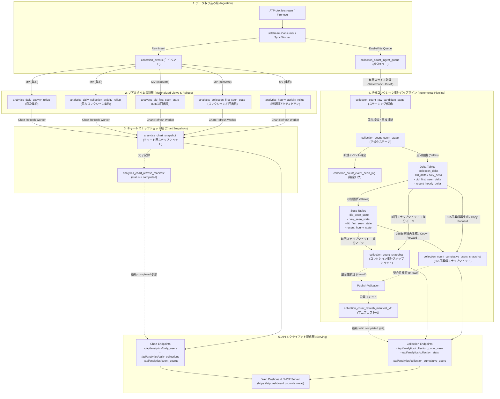

# ATProto Dashboard

ATProtoのFirehoseに流れてくる3rd party collectionを表示できるDashboardです。

This is a dashboard that displays 3rd party collections streamed through the ATProto Firehose.

https://atpdashboard.usounds.work/

## ClickHouse Architecture & Data Flow (ClickHouse関係図)

ATProto Dashboardのデータパイプラインは、大量のFirehoseイベントを高速かつ低負荷で処理するため、**マテリアライズドビューによるリアルタイム集約**と**マニフェスト駆動の有界増分バッチ処理（Incremental Refresh Pipeline）**の二系統で構成されています。

### データフロー全体図



### 主要テーブルと役割

| 分類 | テーブル名 | エンジン | 役割 |
| :--- | :--- | :--- | :--- |
| **生イベント** | `collection_events` | `MergeTree` | Firehoseから取り込んだ全レコードの生イベント（月別パーティション） |
| **増分キュー** | `collection_count_ingest_queue` | `MergeTree` | インクリメンタル集計用の二重書き込みキュー（`queued_at`, `event_key`, `queue_seq` 順） |
| **ロールアップ (MV)** | `analytics_daily_activity_rollup` <br/> `analytics_hourly_activity_rollup` | `AggregatingMergeTree` | 日別・時間別のイベント数、アクティブDID数のリアルタイム中間集計状態 |
| **初回出現ステート** | `analytics_did_first_seen_state` <br/> `analytics_collection_first_seen_state` | `AggregatingMergeTree` | DIDおよびコレクションが初めて確認された日時（`minState`） |
| **チャートスナップショット** | `analytics_chart_snapshot` | `ReplacingMergeTree` | ダッシュボード表示用の7日/30日/365日バケット集計スナップショット |
| **チャートマニフェスト** | `analytics_chart_refresh_manifest` | `ReplacingMergeTree` | チャート生成完了を保証するマニフェスト（APIは `completed` のみ参照） |
| **増分ステージング** | `collection_count_raw_candidate_stage` <br/> `collection_count_event_stage` | `MergeTree` | キューから切り出したバッチ内の重複排除・競合検知・正規化を行う作業テーブル |
| **増分差分 (Delta)** | `collection_count_*_delta` | `MergeTree` | 今回バッチで生じた件数・DID・rkey・初回出現・直近時間別イベントの増分 |
| **増分状態 (State)** | `collection_count_*_seen_state` <br/> `collection_count_did_first_seen_state` <br/> `collection_count_recent_hourly_state` | `MergeTree` / `SummingMergeTree` | 過去から現在までに確認済みのDID/rkeyおよび初回出現日時・直近72時間イベント数 |
| **公開スナップショット** | `collection_count_snapshot` | `ReplacingMergeTree` | コレクションごとの総レコード数、ユニークDID数、直近イベント数などの公開データ |
| **累積ユーザースナップショット** | `collection_count_cumulative_users_snapshot` | `MergeTree` | 各コレクションの過去365日間の日別新規ユーザー数および累積ユーザー数推移 |
| **公開マニフェスト** | `collection_count_refresh_manifest_v2` | `ReplacingMergeTree` | ウォーターマーク、カットオフ、各種書き込み完了フラグ、バリデーション通過を保証する公開メタデータ |

### 設計上の特徴

1. **Manifest-Driven Atomic Visibility（マニフェストによるアトミック公開）**  
   API層は中間生成物や失敗した実行結果を一切読み取らず、マニフェスト（`collection_count_refresh_manifest_v2`）で `status = 'completed'` かつ `validation_passed = 1` が記録された最新の `refresh_id` のみを参照します。これにより、更新処理中もダウンタイムや不整合が発生しません。
2. **有界増分処理（Bounded Incremental Batching）**  
   全件のフルスキャンを避け、前回の完了ウォーターマークから一定件数・期間の有界スライス（Slice）のみをキューから読み込み、過去のスナップショットに差分（Delta）をマージすることで、メモリ制限やタイムアウトを防ぎながら安定運用を実現しています。
3. **効率的な累積ユーザー推移生成（Smart Copy-Forward）**  
   日別365日の累積ユーザー推移（`collection_count_cumulative_users_snapshot`）は、今回のバッチで新規DIDが発生したコレクション、日付変更で再計算が必要なコレクション、および欠落コレクションのみを再生成し、変更のない大多数のコレクションは前回のスナップショットからそのまま高速コピー（Copy-Forward）することで負荷を最小化しています。

## MCP endpoint

ATProto Dashboard exposes a public MCP-style HTTP JSON-RPC endpoint for AI/tool clients.

- MCP JSON-RPC endpoint: `https://dashboardapi.usounds.work/api/mcp`
- Read-only HTTP helper endpoints: `https://dashboardapi.usounds.work/api/analytics/mcp/*`
- Data source: ClickHouse-backed analytics API
- Cache: read-through cache with a 10 minute TTL
- Rate limit: currently 60 requests/minute per client

The MCP endpoint supports standard JSON-RPC methods such as `initialize`, `tools/list`, and `tools/call`.

### Quick checks with curl

List available tools:

```bash
curl -s https://dashboardapi.usounds.work/api/mcp \
  -H 'Content-Type: application/json' \
  --data-binary '{
    "jsonrpc": "2.0",
    "id": 1,
    "method": "tools/list"
  }'
```

Call a tool:

```bash
curl -s https://dashboardapi.usounds.work/api/mcp \
  -H 'Content-Type: application/json' \
  --data-binary '{
    "jsonrpc": "2.0",
    "id": 2,
    "method": "tools/call",
    "params": {
      "name": "get_daily_collections",
      "arguments": {
        "days": 30
      }
    }
  }'
```

The HTTP helper endpoints are useful for quick manual checks without JSON-RPC:

```bash
curl -s 'https://dashboardapi.usounds.work/api/analytics/mcp/new_collection_groups?days=7'
curl -s 'https://dashboardapi.usounds.work/api/analytics/mcp/collections_for_namespace?namespace_prefix=app.bsky'
curl -s 'https://dashboardapi.usounds.work/api/analytics/mcp/daily_users?days=30'
curl -s 'https://dashboardapi.usounds.work/api/analytics/mcp/daily_collections?days=30'
```

### Claude Desktop configuration

If your client supports remote HTTP MCP directly, use:

```text
https://dashboardapi.usounds.work/api/mcp
```

For Claude Desktop environments that expect a stdio MCP server, use an HTTP bridge such as `mcp-remote`:

```json
{
  "mcpServers": {
    "atpdashboard": {
      "command": "npx",
      "args": [
        "-y",
        "mcp-remote",
        "https://dashboardapi.usounds.work/api/mcp"
      ]
    }
  }
}
```

### Codex configuration

For Codex environments that support MCP server entries, the same stdio bridge pattern can be used:

```toml
[mcp_servers.atpdashboard]
command = "npx"
args = ["-y", "mcp-remote", "https://dashboardapi.usounds.work/api/mcp"]
```

If your Codex environment supports remote HTTP MCP URLs directly, configure the server URL as:

```toml
[mcp_servers.atpdashboard]
url = "https://dashboardapi.usounds.work/api/mcp"
enabled = true
```

### Gemini CLI configuration

Gemini CLI distinguishes SSE and Streamable HTTP transports. Use `httpUrl` for this endpoint; `url` is treated as an SSE endpoint in Gemini CLI settings.

```json
{
  "mcpServers": {
    "atpdashboard": {
      "httpUrl": "https://dashboardapi.usounds.work/api/mcp"
    }
  }
}
```

You can also add it with the Gemini CLI:

```bash
gemini mcp add --transport http atpdashboard https://dashboardapi.usounds.work/api/mcp
```

## MCP tools

### `get_new_collection_groups`

Returns namespace-grouped ATProto collections/NSIDs first observed in a recent window or explicit date range.

Parameters:

- `days`: integer, 1 to 14, default `7`
- `start_date`: optional date string, accepted formats include `YYYY-MM-DD`, `YYYY/MM/DD`, and Japanese date strings such as `2026年5月7日`
- `end_date`: optional date string, same accepted formats as `start_date`

Use this for questions such as "new NSIDs in the last 7 days" or "NSIDs born on 2026-05-07". Date-specific questions should usually be interpreted as namespace groups unless the user explicitly asks for individual NSIDs.

### `get_collections_for_namespace`

Lists observed ATProto collections/NSIDs under a namespace prefix and, when possible, resolves Lexicon definitions for schema summaries.

Parameters:

- `namespace_prefix`: required string, for example `app.bsky` or `app.bsky.*`

This tool is for schema and NSID discovery. Do not use it to fetch or display real record JSON bodies.

### `get_daily_users`

Returns rolling 24 hour bucket time series for Daily Users.

Parameters:

- `days`: integer, 1 to 365, default `7`

Rows include `date`, `day_offset`, `active`, and `new`. Use `days=7` for This Week, `days=30` for This Month, and `days=365` for This Year.

### `get_daily_collections`

Returns rolling 24 hour bucket time series for Daily Collections.

Parameters:

- `days`: integer, 1 to 365, default `30`

Rows include `date`, `day_offset`, `active`, and `new`. Use `days=7` for This Week, `days=30` for This Month, and `days=365` for This Year.

### `get_latest_record_for_collection`

Finds the latest observed record for a collection/NSID by `created_at`.

Parameters:

- `collection`: required ATProto collection/NSID, for example `app.bsky.feed.like`

This tool returns guidance for checking the record in `pds.ls`. Do not fetch, paste, or display the full real record JSON body in chat.
